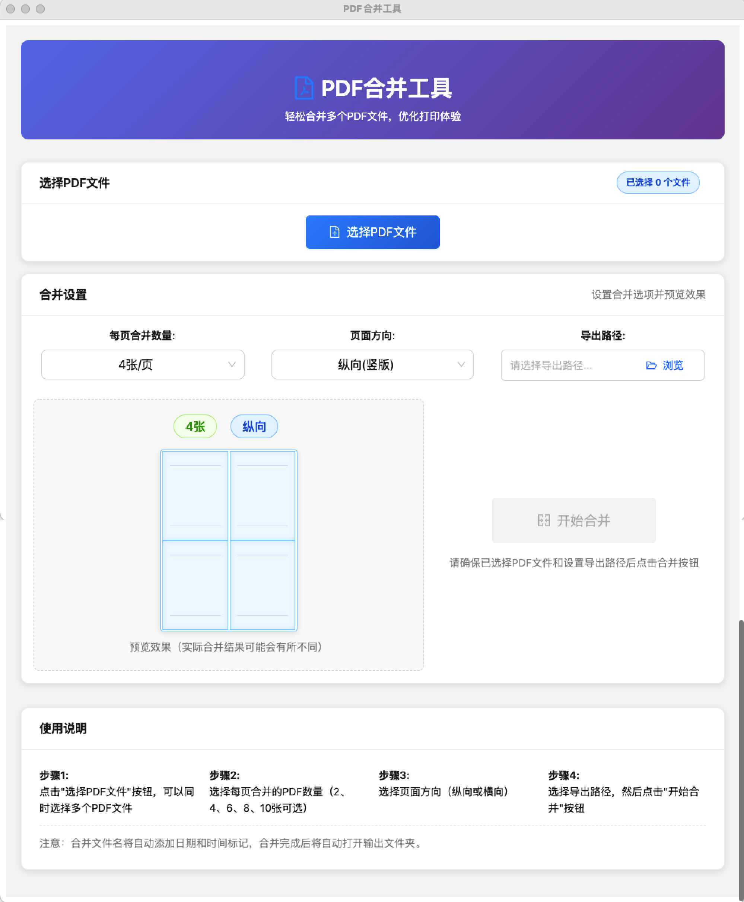

# PDF合并工具

> 一款简单易用的PDF文件合并工具，为解决报销场景下发票打印浪费问题而设计。


## 功能特性

- 支持多个PDF文件的选择与合并
- 可自定义每页合并的PDF数量（2、4、6、8、10张可选）
- 支持纵向（竖版）和横向（横版）两种页面方向
- 提供直观的预览效果，显示不同合并模式下的布局
- 智能布局算法，确保纵向模式下实现列优先排列，横向模式下实现行优先排列
- 合并文件自动添加日期和时间标记
- 合并完成后自动打开输出文件夹
- 跨平台支持：Windows 和 macOS

## 安装与运行

### 开发环境

```bash
# 克隆项目
git clone https://github.com/qxh/pdf-merge-tool.git
cd pdf-merge-tool

# 安装依赖
npm install

# 启动开发服务器
npm run dev
```

### 构建可执行文件

```bash
# 构建所有平台的可执行文件
npm run build

# 构建Windows可执行文件
npm run build:win
# 构建macOS可执行文件
npm run build:mac

# 仅构建当前平台的可执行文件
npm run build:current
```

## 使用说明

1. **选择PDF文件**：点击"选择PDF文件"按钮，可以同时选择多个PDF文件
2. **设置合并参数**：
   - 选择每页合并的PDF数量（2、4、6、8、10张可选）
   - 选择页面方向（纵向或横向）
3. **选择导出路径**：点击"浏览"按钮，选择合并后的PDF文件保存位置
4. **开始合并**：点击"开始合并"按钮，等待合并完成

## 技术栈

- **前端**：React + Ant Design
- **后端**：Electron
- **PDF处理**：pdf-lib
- **开发工具**：Electron Builder

## 主要特性详解

### 多种布局模式

- **纵向模式**：采用列优先排列（从上到下，从左到右），适合查看文字内容较多的PDF
- **横向模式**：采用行优先排列（从左到右，从上到下），适合查看图片为主的PDF

### 智能间距调整

根据合并数量和页面方向，自动调整PDF之间的间距，确保页面布局美观、紧凑：
- 合并数量越多，间距自动调整得越小
- 纵向模式下针对上下间距进行了特别优化
- 横向模式下确保2×2、3×2等标准网格布局

### 文件命名与管理

- 合并后的文件名自动添加年月日时间标记（格式：merged_YYYY_MM_DD_HH_MM_SS.pdf）
- 合并完成后自动打开输出文件夹，方便用户立即查看或使用合并后的文件

## 界面预览



## 贡献者

- qxh - 项目发起人与主要开发者

## 许可证

[GPL-3.0](LICENSE) 